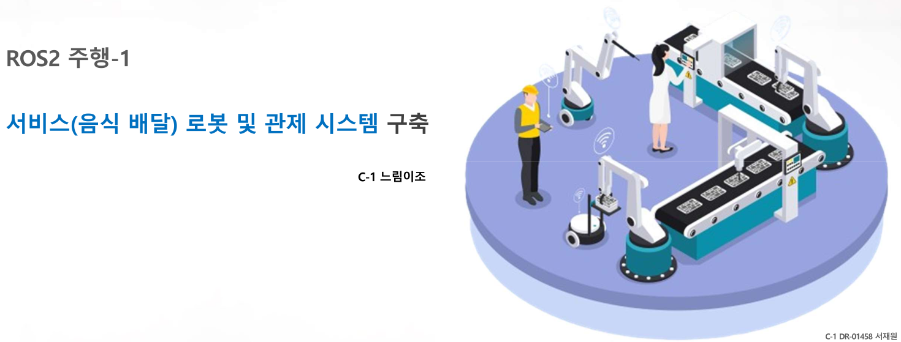
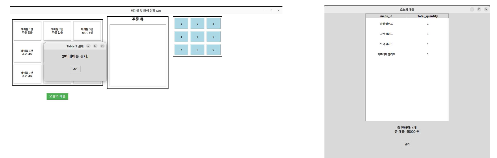
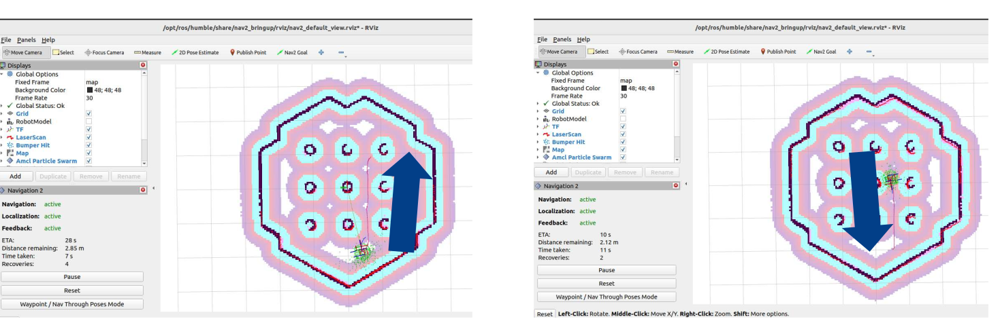

# 1주차 프로젝트: ROS2를 활용한 주방 서빙로봇 시스템 개발 

## 0. 발표 pdf

---
## 1. 프로젝트 개요
본 프로젝트는 테이블 오더를 통한 주문 관리, 주방 디스플레이를 활용한 주문 접수 및 서빙 로봇 제어, 데이터베이스를 통한 주문 내역 저장 및 통계 분석을 목표로 한다.

---
## 2. 기능 목록
1. **테이블 오더를 통한 주문**
2. **주방 디스플레이를 통한 주문 접수**
   - 접수 소리, 알람, 접수, 취소 기능 포함
3. **주방 디스플레이를 통한 서빙 로봇 제어**
4. **서빙 로봇 작동**
5. **데이터베이스 데이터를 이용한 통계 분석**
6. **nav2 param 조정을 통한 로봇 작동 최적화**
7. **Logging 기능**
8. **QoS (Quality of Service)**
9. **토픽, 서비스, 액션 각각 한 개 이상 사용**

---

## 3. 프로세스 
1. 테이블 번호를 부여함
2. 주문한 메뉴 및 수량 출력
3. 해당 메뉴의 수량을 입력된 테이블 번호의 주문에 입력
4. 해당 테이블의 주문을 취소하거나 전송하여 주방에 요청 가능
5. 테이블별 주문 내역과 고객 안내 조리 완료 시간을 표출
6. 로봇을 해당 테이블로 보내는 명령을 위해 좌표 전송
7. FIFO 기준으로 테이블별 주문을 시간순으로 정렬
8. 입력된 총 주문 내역과 매출 합산 정보를 표출

---

## 4. 역할 및 담당 업무

### 서재원 (조장)
- **프로젝트 계획**
  - 요구사항 문서 (플로우차트) 작성
  - 작업분해구조도(WBS) 작성
  - 일정표, Gantt 차트, 리소스 배치 계획 수립
- **개발**
  - 식당 A 패키지 구축
  - 식당 A GUI 및 관련 기능 구축
  - SQLite 기반 데이터베이스 설계 및 구축
  - DB 연동 통신 모듈 개발
- **최종 산출물 및 발표**
  - 프로젝트 최종 점검
  - 프로젝트 발표 진행

### 정의재
- **개발**
  - 식당 B 패키지 구축
  - 식당 B GUI 및 관련 기능 구축
  - 식당 통신 모듈 (식당 - 로봇) 구축
- **프로젝트 최종 준비**
  - 발표 자료 작성
  - 프로젝트 발표 리허설 진행

### 김근제
- **로봇 관련 개발**
  - 로봇 패키지 취합 및 노드 구축
  - 로봇 GUI 및 관련 기능 구축
  - 로봇 통신 모듈 개발
  - Navigation 기능 구현

### 김차훈
- **메뉴 관련 개발**
  - 메뉴 패키지 구축
  - 메뉴 GUI 및 관련 기능 구축
  - 메뉴 - 식당 간 통신 기능 구현

### 팀 전원
- **프로토타입 및 내부 평가**
  - 음식점 서빙 시스템 프로토타입 개발
  - 초기 산출물 테스트 및 평가
  - 각 영역별 추가 개발 및 내부 검수
  - 프로젝트 최종 산출물 점검 및 발표 리허설

---

## 5. 주문 처리 및 로봇 이동

### 주문 처리 (Service)
- **OrderNode 클래스**
  - ROS2의 `Node`를 상속받아 클라이언트를 생성하고 `order_service`에 연결
  - `wait_for_service()`로 서비스 활성화 대기 (1초마다 로그 출력)
  - 주문 항목을 `OrderService.Request()` 객체에 설정하여 서버에 전송
  - `call_async(request)`로 비동기 주문 처리 (GUI 차단 방지)
  - 응답이 오면 `handle_response`에서 결과 처리

### 로봇 이동 (Action Client)
- **navigate_to_goals() 및 navigate_to_pose_send_goal()**
  - 미리 정의된 목표 지점 (`goal_poses`)으로 로봇 이동
  - `NavigateToPose` 액션을 활용하여 목표 지점으로 로봇 이동 수행

---

## 6. 큐 기반 통신 (비동기 이벤트 처리)
- **각 스레드는 자신의 큐 (`action_queue`, `service_queue`)를 통해 외부 이벤트를 처리**
- **이벤트 큐 처리**
  - 외부에서 `add_event()` 호출 시 `queue.get()`을 통해 처리
- **비동기 이벤트 처리**
  - 큐에 이벤트가 들어오면 스레드가 적절한 작업을 수행
- **스레드 종료**
  - `stop()` 메서드를 사용하여 스레드를 안전하게 종료 가능

## 7. 프로젝트 결과물

